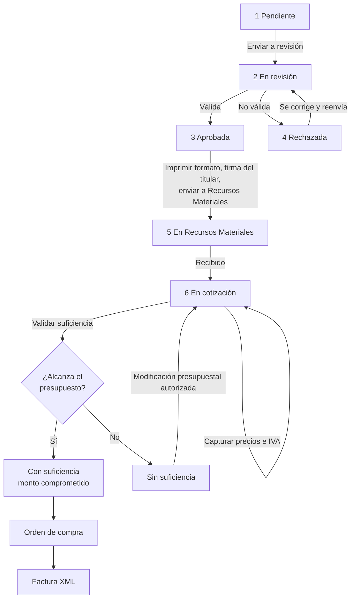

# Módulos

Menú lateral: **Panel**, **Presupuesto**, **Requisiciones** (listado, nueva, Recursos Materiales, proveedores, cómo va el gasto, modificaciones presupuestales), **Secretarías** y **Administración**. Cada entrada aparece solo con su permiso (ver [Permisos](permisos.md)).

## Panel

`/dashboard` — Resumen del presupuesto de las unidades del usuario (asignado, modificado, vigente, comprometido, en trámite, disponible) y lo pendiente en cada etapa: requisiciones por enviar, en revisión, en Recursos Materiales, con suficiencia sin orden de compra y modificaciones por autorizar. Cada tarjeta lleva a su listado.

---

## Presupuesto

`/presupuesto` (solo Admin) — Presupuesto de egresos importado desde Excel a la tabla `presupuesto 2024`. Cada **línea** es una combinación **unidad administrativa + fuente de financiamiento + proyecto + partida**, con su importe anual y mensual.

`PresupuestoService` calcula para cada línea:

| Saldo | Cálculo |
|---|---|
| Asignado | Importe importado |
| Modificado | Suma de modificaciones presupuestales **autorizadas** (+ destino, − origen) |
| Vigente | Asignado ± modificado |
| Comprometido | Total de requisiciones **con suficiencia** |
| En trámite | Requisiciones cotizadas que aún no tienen suficiencia |
| Disponible | Vigente − comprometido |

Las modificaciones se guardan por clave de línea (no por id), así que sobreviven a una re-importación del presupuesto.

`/requisiciones/gasto` ("Cómo va el gasto") muestra estos saldos por línea de las unidades del usuario, con filtro por unidad, búsqueda y opción de ver solo partidas con movimiento.

## Requisiciones

`/requisiciones` — Cada usuario ve solo las requisiciones de las **unidades administrativas de su secretaría** (la relación se configura en Secretarías). Admin ve todas.

- Captura: fecha de trámite, unidad administrativa, concepto y renglones con **Partida / Proyecto / Fuente** (tres columnas encadenadas: cada una solo ofrece valores que combinan con lo ya elegido y que tienen disponible), cantidad y descripción. Al guardar se valida que cada renglón exista en el presupuesto de la unidad.
- Folio: prefijo de la secretaría + consecutivo anual (`REQ-0001` si la secretaría no tiene prefijo).
- El monto total siempre es la suma de los conceptos.

**Cuándo se puede editar:** en Pendiente y Rechazada; en cotización solo los precios y el IVA, hasta que tenga suficiencia. En revisión, aprobada y en Recursos Materiales no se puede modificar (también se bloquea en el servidor). El formato FUR se imprime desde que es válida.

## Recursos Materiales

`/recursos-materiales` — Bandeja de todas las secretarías con requisiciones en Recursos Materiales y en cotización.

1. **Recibido**: inicia la cotización.
2. **Editar cotización**: precio unitario por concepto y si **lleva IVA** (16 %).
3. **Validar suficiencia presupuestal**: compara lo cotizado contra el disponible de cada línea. Un mensaje muestra el resultado por partida (requerido, disponible, faltante) y la requisición queda **Con suficiencia** o **Sin suficiencia**. Si se cambian los precios después, hay que volver a validar.
4. **Sin suficiencia**: el botón *Solicitar modificación presupuestal* abre la solicitud con la partida que no alcanza y el importe faltante ya llenos.
5. **Con suficiencia**: *Generar orden de compra*.

## Órdenes de compra y facturas

- Se elige el **proveedor** (`/proveedores`, catálogo con RFC), la fecha y observaciones. Folio `OC-AÑO-0001`; el importe es el total de la requisición. PDF imprimible.
- **Cargar factura (XML CFDI 3.3/4.0)**: se rechaza si
  - el total del CFDI no coincide con lo cotizado (tolerancia de 1 centavo),
  - el RFC del emisor no es el del proveedor de la orden,
  - el XML no está timbrado (sin UUID) o el UUID ya se cargó en otra orden.
- El XML se guarda en el disco privado (`storage/app/private/ordenes-compra/`) y se puede descargar.

## Modificaciones presupuestales

`/modificaciones-presupuestales`

| Tipo | Efecto |
|---|---|
| Traspaso | Quita de una línea (origen) y da a otra (destino) |
| Reducción | Solo disminuye una línea (p. ej. no se alcanzó la meta de la Ley de Ingresos) |
| Ampliación | Solo aumenta una línea |

1. El área registra la solicitud (folio `MP-AÑO-0001`) con importe y justificación. El origen no puede quedar en negativo.
2. Se imprime el formato para firma.
3. El **Jefe de Control Presupuestal** (permiso `modificaciones-autorizar`) la **autoriza** (procede) o la **rechaza** (no procede, con motivo). Al autorizar se vuelve a revisar el disponible del origen y el presupuesto vigente cambia de inmediato.
4. El listado es el **historial**, con filtros por folio, tipo, estado y partida.

Las áreas solo ven y usan líneas de sus unidades; quien autoriza ve todas.

---

## Administración

- `/secretarias` — Secretarías: nombre, **prefijo de folios** de requisiciones y **unidades administrativas** asignadas (define qué requisiciones y presupuesto ve cada área).
- `/settings/users` — Usuarios: rol y secretaría.
- `/settings/roles`, `/settings/permissions` — Roles y permisos (ver [Permisos](permisos.md)).
- `/support-tickets` — Tickets de soporte con comentarios y notificaciones.
- `/logs` — Visor del log de Laravel.
